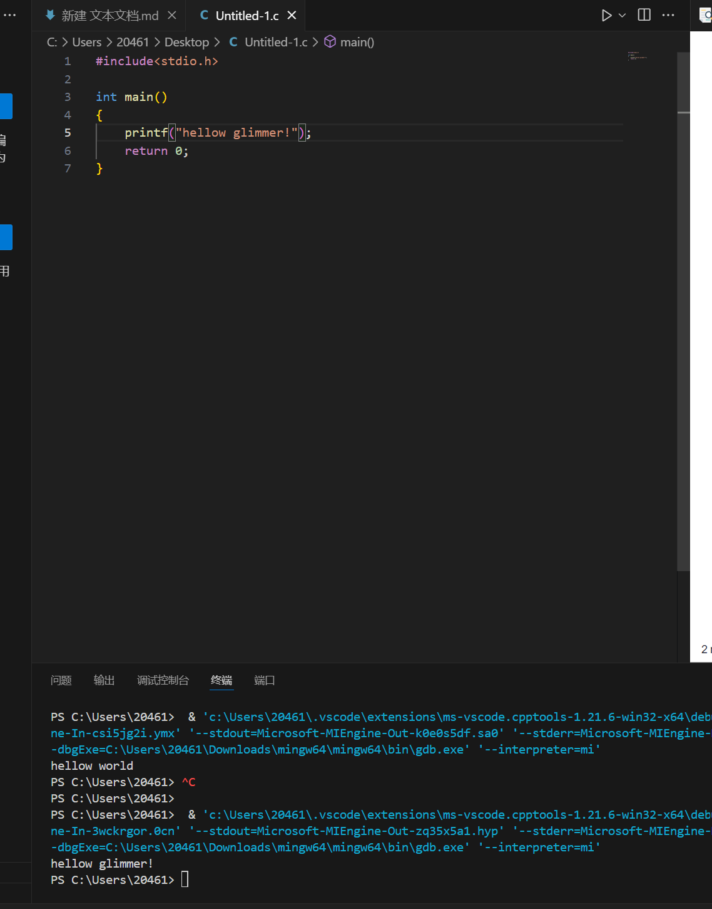
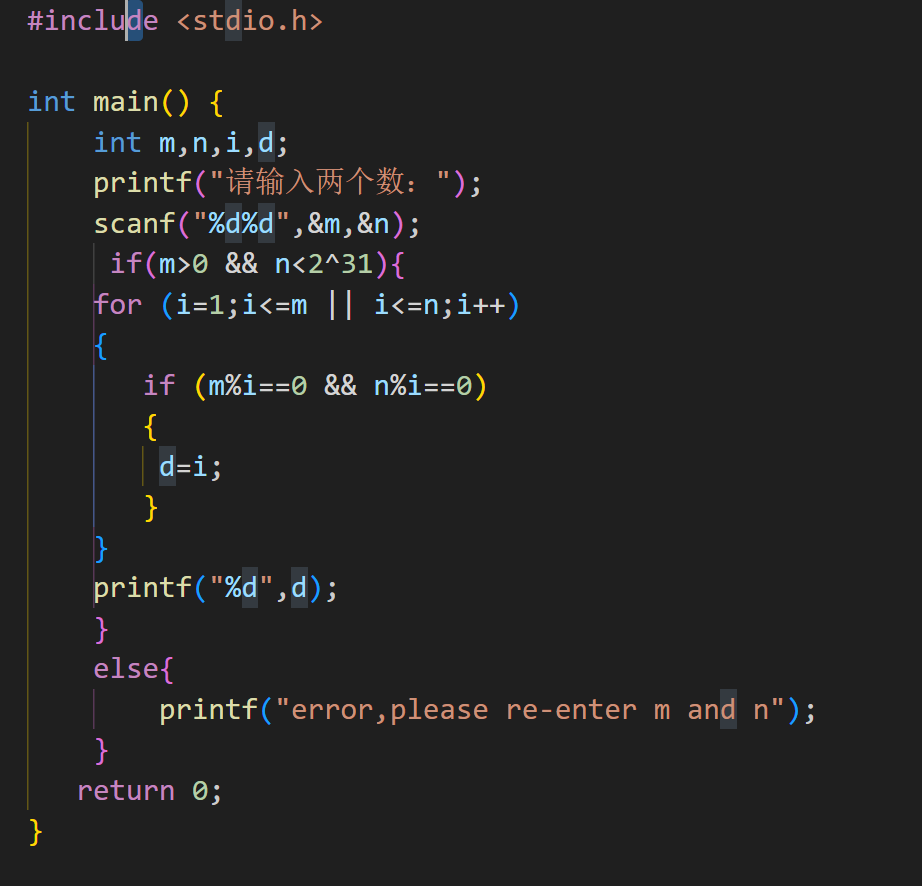

# 第一个程序
## 1.高级语言更接近自然语言，而机器语言则为01形式，对普通人不友好，一般人要翻译过来十分麻烦。我更喜欢高级语言，低级语言作为机器执行工作的指令，因为简单从而提高工作效率，程序设计的宗旨一定离不开人，为了使用方便，最后应当会倾向高级语言。
## 2.
## include <stdio.h>
明确c语言输入输出库，从<stdio.h>头文件信息包含在程序中
 ## int main()
  每个C程序的入口点。当操作系统执行一个C程序时，它会自动调用 int main() 函数
 {
## printf("Hello, world!");
    输出字符串Hello,World
## return 0;
表明程序终止时将操作系统返回0
}
## 3.删去return 0;不会影响
## 4.
## int为整型元素；
## c99标准发布后，里面明确规定定义main时要定义成int型，原因是因为main函数是系统调用的，在main函数运行结束后，要返回一个值给操作系统，以此main函数是否执行正常，如果main返回值为0说明正常结束
## 5.
# 基础语法运用
#include <stdio.h>
int main() 
{
    int code;
    for(;;)
    {
		printf("Show me your code,please.");
        scanf("%d",&code);
        if(code >= 100000 && code <= 999999)
        {
        printf("I am super hacker!");
        break;
        }
        else{
         printf("Fake code!");
         }
    }
    return 0;
}
下图是上述代码的原本形式

  
  